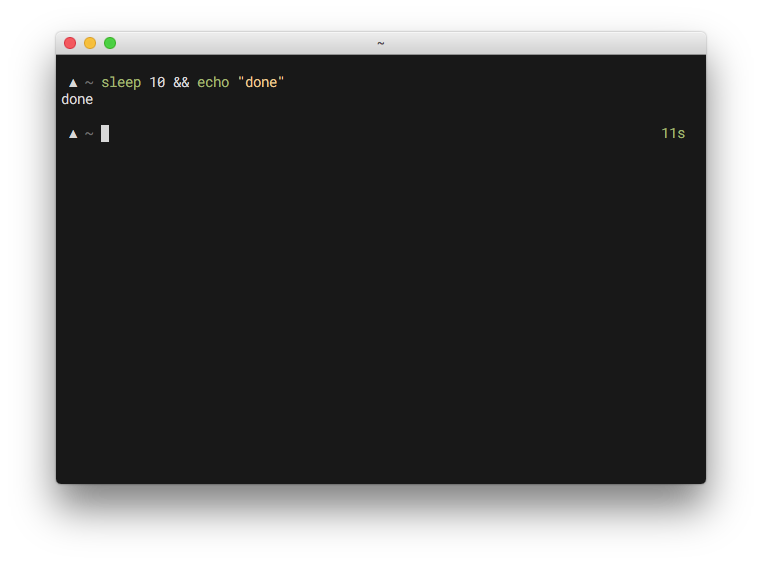

# geometry

[](https://gitter.im/geometry-zsh/Lobby)
[](https://trello.com/b/GfM4e6Ro/geometry)
[](https://github.com/geometry-zsh/geometry/releases/latest)

geometry is a minimalistic, fully customizable zsh prompt theme.


geometry starts small, with good defaults, and allows you to customize it at your own will. It can be as simple or complex as you like.

* [Installing](#installing)
* [Dependencies](#dependencies)
* [What it Does](#what-it-does)
* [Plugins](#plugins)
* [Configuration](#configuration)
* [FAQs](#faqs)
* [Maintainers](#maintainers)

## Installing

*K, I'm sold. Beam me up, Scotty.*


### Install using antigen

Just add `antigen theme geometry-zsh/geometry` to your `.zshrc`.


### Install using oh-my-zsh

Move the entire `geometry` folder to `$HOME/.oh-my-zsh/custom/themes`, and set `ZSH_THEME="geometry/geometry"` in your `.zshrc`.


### Install using zplug

Add `zplug "geometry-zsh/geometry"` to your `.zshrc`.

### Manual install

Clone this repository as follows:

    git clone https://github.com/geometry-zsh/geometry
    cd geometry
    git submodule update --init --recursive

Then add it to your `.zshrc` configuration:

    source /path/to/geometry/geometry.zsh

## Dependencies

The symbol for rebasing comes from a [Powerline patched font](https://github.com/powerline/fonts). If you want to use it, you're going to need to install one from the font repo. The font used in the screenshots is [Roboto Mono](https://github.com/powerline/fonts/tree/master/RobotoMono). You can also try to [patch it yourself](https://github.com/powerline/fontpatcher).

You can also change the rebase symbol by setting the `GEOMETRY_SYMBOL_GIT_REBASE` variable.

## What it does

To allow a pleasant configuration and customization, geometry works with the concept of plugins.

In a nutshell, it can:

- give you a custom, colorizable prompt symbol
- change the prompt symbol color according to the last command exit status
- make the prompt symbol color change with your hostname
- display current git branch, state and time since last commit
- tell you whether you need to pull, push or if you're mid-rebase
- display the number of conflicting files and total number of conflicts
- display if there is a stash
- display the running time of long running commands
- set the terminal title to current command and directory
- make you the coolest hacker in the whole Starbucks

The right side prompt is printed asynchronously, so you know it's going to be
fast™.

## Plugins

geometry has an internal plugin architecture. The default plugins are `exec_time`, `git` and `hg`.
But you can enable a variety of built-in plugins just by setting the `GEOMETRY_PROMPT_PLUGINS` variable in your own configuration files:

```sh
GEOMETRY_PROMPT_PLUGINS=(virtualenv docker_machine exec_time git hg)
```

*Note: if you're not sure where to put geometry configs, just add them to your `.zshrc`*.

These plugins will load and display on the right prompt. You can check the
documentation and configuration for each specific plugin in the
[plugins](/plugins) directory.

Some plugins only render when you are in a given directory or in the presence of a given file.
You can have those plugins always render by pinning a `+` before the name.

```sh
export GEOMETRY_PROMPT_PLUGINS=(exec_time git +rustup) # rustup will always render
```

geometry also supports your own custom plugins. See the plugin [documentation](/plugins/README.md) for
instructions and examples.

Please check out and share third-party plugins on our [Plugins wiki page](https://github.com/geometry-zsh/geometry/wiki/Plugins).

## Configuration

geometry was built with easy configuration in mind. The best way to do so is by
[using environment variables](https://github.com/fribmendes/dotfiles/blob/7f448626e1c6e9c0ab7b474c5ff2c1939b64b7d2/system/prompt.zsh#L18-L24).

Pretty much everything in geometry can be changed by setting a variable **before
you load the theme**.

The default options try to balance the theme in order to be both lightweight and contain useful features.

### Symbols

There are a set of symbols available which you can override with environment variables.

```shell
GEOMETRY_SYMBOL_PROMPT="▲"                  # default prompt symbol
GEOMETRY_SYMBOL_RPROMPT="◇"                 # multiline prompts
GEOMETRY_SYMBOL_EXIT_VALUE="△"              # displayed when exit value is != 0
GEOMETRY_SYMBOL_ROOT="▲"                    # when logged in user is root
```

You can find symbol configuration for specific plugins under the
[plugins](/plugins) directory.

### Colors

The following color definitions are available for configuration:

```shell
GEOMETRY_COLOR_EXIT_VALUE="magenta"         # prompt symbol color when exit value is != 0
GEOMETRY_COLOR_PROMPT="white"               # prompt symbol color
GEOMETRY_COLOR_ROOT="red"                   # root prompt symbol color
GEOMETRY_COLOR_DIR="blue"                   # current directory color
```

You can find color configuration for specific plugins under the
[plugins](/plugins) directory.


### Misc

```shell
GEOMETRY_PROMPT_PREFIX="$'\n'"              # prefix prompt with a new line
GEOMETRY_PROMPT_SUFFIX=""                   # suffix prompt
GEOMETRY_PROMPT_PREFIX_SPACER=" "           # string to place between prefix and symbol
GEOMETRY_SYMBOL_SPACER=" "                  # string to place between symbol and directory
GEOMETRY_DIR_SPACER=" "                     # string to place between directory and suffix
GEOMETRY_PLUGIN_SEPARATOR=" "               # use ' ' to separate right prompt parts
GEOMETRY_GREP=""                            # define which grep-like tool to use (By default it looks for rg, ag and finally grep)
```

### Features

#### Async `RPROMPT`

geometry runs `RPROMPT` asynchronously to avoid blocking on costly operations. This is enabled by default but you can disable it by setting `PROMPT_GEOMETRY_RPROMPT_ASYNC` to `false`.

#### Randomly colorize prompt symbol

Your prompt symbol can change colors based on a simple hash of your hostname. To enable this, set `PROMPT_GEOMETRY_COLORIZE_SYMBOL` to `true`.


#### Colorize prompt symbol when root

You can have your prompt symbol change color when running under the `root` user.

To activate this option, just set `PROMPT_GEOMETRY_COLORIZE_ROOT` to `true`. Both symbol and color can be customized by overriding the `GEOMETRY_SYMBOL_ROOT` and `GEOMETRY_COLOR_ROOT` variables.

Note that this option overrides the color hashing of your prompt symbol.

#### Display elapsed time for long-running commands

You can optionally show a time display for long-running commands
by setting the `PROMPT_GEOMETRY_EXEC_TIME` variable to `true`.

If enabled, this shows the elapsed time for commands running longer than 5 seconds. You can change this threshold by changing `PROMPT_GEOMETRY_COMMAND_MAX_EXEC_TIME` to the number of desired seconds.



## FAQs

**I found a bug. What do I do?**

Open an issue. There are probably more people with that very same problem so we like to keep everything documented in case someone else comes looking for a solution.

If you can provide info about your terminal, OS and zsh version it would be a great starting point. It would also be of great assistance if you are able to write steps to reproduce the issue.

**I have an idea for a feature, can I submit a PR?**

Please do. geometry is a work in progress, so if you want to help improve it, your
idea is welcome. We're not looking to add a lot of default features to not
overload the theme. However, plugins are a great way of extending geometry
without overloading it. If you have an idea for a plugin, feel free to
submit it and we'll always give our best to provide constructive feedback and
help you improve.

**Is there anything specific I can do to help?**

There are always things we would like to improve. Feel free to jump in on any issue to tackle it or just to provide your feedback.

As for PRs, we are currently looking to improve performance.

**Why doesn't my prompt look like the screenshots?**

Well, I use [`z`](https://github.com/rupa/z) for jumping around and
[`zsh-syntax-highlighting`](https://github.com/zsh-users/zsh-syntax-highlighting/)
for those pretty command colors. You might also want to look into [base16](https://github.com/chriskempson/base16) to get similar colors.

**Where do I put my geometry configuration files?**

Well, anywhere in your `.zshrc` file should be fine, **as long as you define
variables before geometry is loaded**.

**My tab completion is weird.**

[Relevant xkcd](http://xkcd.com/1726/)

This is a [known problem](https://github.com/geometry-zsh/geometry/issues/3#issuecomment-244875921) due to the use of unicode characters. It should be fixed right now. If it persists, update geometry and check if the terminal version reported by zsh matches your terminal emulator reported version. Please comment on that thread if any new issues arise.

**My syntax highlighting gets thrown off in version controled directories...**

Yeah, turns out this might be an issue with `zsh-syntax-highlighting` [as described here](https://github.com/geometry-zsh/geometry/issues/214#issuecomment-396057863). We recommend trying [`zdharma/fast-syntax-highlighting`](https://github.com/zdharma/fast-syntax-highlighting) instead. If the problem persists, [comment on this issue](https://github.com/geometry-zsh/geometry/issues/214).

**There are too many/few spaces after the symbol or the prompt.**

You're probably using a different prompt character. zsh has a few issues determining the length of the prompt and while it should work for most cases, changing the symbol to a different character (an example would be:  ☁︎ )
will result in a few extra spaces after the prompt. That problem is [documented here](https://github.com/geometry-zsh/geometry/issues/3#issuecomment-245571623) and there is no known fix for it except on a case-by-case basis. You can add or remove any extra space through the `prompt_geometry_render` function in `geometry.zsh`. If you find a universal solution, feel free to make a PR for it.

**The prompt is slow on large repos.**

This is also a known issue. Make sure you have `PROMPT_GEOMETRY_RPROMPT_ASYNC` set to `true` to avoid long waiting times. If the problem persists, our recommendation would be to disable the git time checks by setting `PROMPT_GEOMETRY_GIT_TIME` to `false`.

**That's a neat font you have there. Can I have it?**

Sure. It's [Roboto Mono](https://fonts.google.com/specimen/Roboto+Mono). Don't forget to use the [powerline patched version](https://github.com/powerline/fonts/tree/master/RobotoMono) if you want to use the default rebase symbol.

**"Warning: Plugin <name> already registered." omg what is happening is the
world going to end?**

Well, yeah. Eventually. But this warning message doesn't mean anything is wrong.
Feel free to relax. It shows when you load geometry twice. It was intended as a
warning for faulty custom configuration, such as registering a plugin in two
different places. If you do `source ~/.zshrc` it's perfectly normal to show up.
See [this discussion](https://github.com/geometry-zsh/geometry/issues/109#issuecomment-288997441) for more info.

## Maintainers

geometry is currently maintained by [fribmendes](https://github.com/fribmendes), [desyncr](https://github.com/desyncr) and [jedahan](https://github.com/jedahan).

A big thank you to those who have previously [contributed](https://github.com/geometry-zsh/geometry/graphs/contributors).
