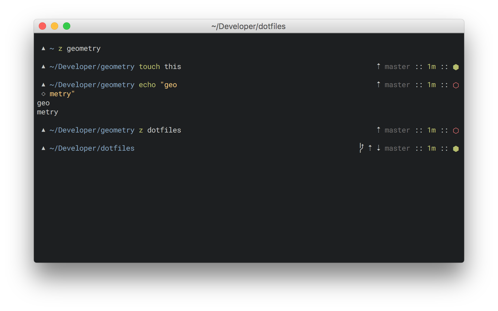

# geometry

geometry is a minimal zsh prompt theme.

I started chopping away at [Avit](https://github.com/robbyrussell/oh-my-zsh/blob/master/themes/avit.zsh-theme) until I ended up with something minimal and inspired on [Pure](https://github.com/sindresorhus/pure).

What it does:

- display current git branch
- display time since last commit
- display state (clean/dirty) of the repo
- display arrows indicating if you need to pull, push or if you are mid-rebase
- set the terminal title to current command and directory

