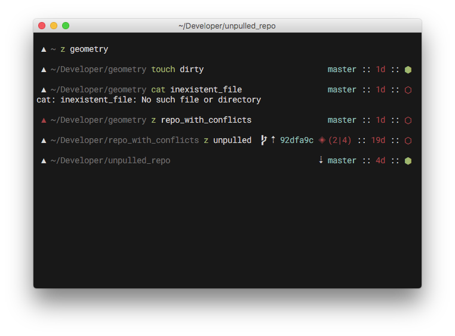
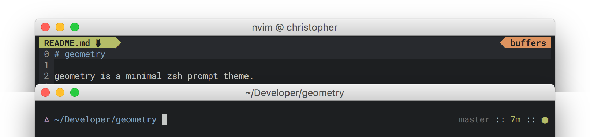
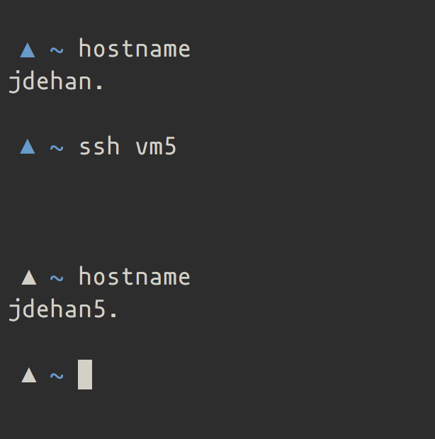

# geometry

geometry is a minimal, customizable zsh prompt theme.

I started chopping away at [Avit](https://github.com/robbyrussell/oh-my-zsh/blob/master/themes/avit.zsh-theme) until I ended up with something minimal and inspired on [Pure](https://github.com/sindresorhus/pure).

What it does:

- display current git branch
- display colored time since last commit (optional)
- display the running time of long running commands
- display state (clean/dirty) of the repo
- display arrows indicating if you need to pull, push or if you are mid-rebase
- set the terminal title to current command and directory
- display the number of git conflicts and total conflicts (optional)
- colorize the ▲ based on the current hostname (optional)
- colorize the ▲ when running under root user (optional)
- make you the coolest hacker in the whole Starbucks

Much like [Pure](https://github.com/sindresorhus/pure), geometry adds a different marker
if the last command result is different from `0`. It also sets the title to
`[command @] directory`. Check the title and marker here:

## Installing

### antigen

Just add `antigen bundle frmendes/geometry` to your `.zshrc`.

### oh-my-zsh

Move `geometry.zsh` to `$HOME/.oh-my-zsh/custom/themes/geometry.zsh-theme` and
set `ZSH_THEME="geometry"` in your `.zshrc`.

### zplug

Add `zplug "frmendes/geometry"` to your `.zshrc`

### Dependencies

The symbol for rebasing comes from a [Powerline patched font](https://github.com/powerline/fonts). If you want to use it, you're going to need to install one from the font repo. The one used in the screenshots is Roboto Mono. You can also try to [patch it yourself](https://github.com/powerline/fontpatcher).

Alternatively, change the symbol by setting the `GEOMETRY_SYMBOL_GIT_REBASE` variable. [See options](#options)

### Options

geometry has plenty of customization options available. Just set the variables in the
beginning of the `geometry.zsh` file to whatever you like! You can also set the custom options in
your `.zshrc` before loading the prompt. See my
[dotfiles](https://github.com/frmendes/dotfiles) where I [set the options for
geometry](https://github.com/frmendes/dotfiles/blob/master/system/prompt.zsh#L17-L22)
before [loading antibody](https://github.com/frmendes/dotfiles/blob/master/zsh/zshrc.symlink#L10-L14).

#### git conflicts

You can optionally have the prompt display both the number of files with
conflicts as well as the total number of conflicts by setting the
`PROMPT_GEOMETRY_GIT_CONFLICTS` variable to true.

This option uses `grep` and `ag` with the latter being a [much faster alternative](http://geoff.greer.fm/ag/).

**If you don't have `ag` installed, this might slow your prompt down**.

#### git time since last commit

You can optionally hide the time since last commit by setting the
`PROMPT_GEOMETRY_GIT_TIME` variable to false. You might want to
do this if the prompt is too slow on large repositories.

#### colorized symbol ▲

You can optionally have the ▲ (or whatever `GEOMETRY_PROMPT_SYMBOL` you set)
change colors based on a simple hash of your hostname by setting the
`PROMPT_GEOMETRY_COLORIZE_SYMBOL` variable to true.

#### colorize root

You can have your prompt symbol change colors when running under the root user.

To activate this option, just set `PROMPT_GEOMETRY_COLORIZE_ROOT` to true. Symbol and color can be customized by changing the `GEOMETRY_SYMBOL_ROOT` and `GEOMETRY_COLOR_ROOT` variables.

Note that this option overrides the color hashing of your prompt symbol.

#### time elapsed for long-running commands

You can optionally hide the time display for long-running commands
by setting the `PROMPT_GEOMETRY_EXEC_TIME` variable to false.

### FAQs

**I have an idea for a feature, can I submit a PR?**

Please do. geometry is a work in progress so anything you can do to improve it
is very welcome.

**This is slow on large repos. What can I do about it?**

Unfortunately, this is a known issue and is being worked upon. Disabling some of
the git features will help you, but [async render](https://github.com/frmendes/geometry/issues/6) is on the roadmap. If you
have some input or want to help, please submit a PR or comment the issue.

**My tab completion is weird.**

[Relevant xkcd](http://xkcd.com/1726/)

This is a [known problem](https://github.com/frmendes/geometry/issues/3#issuecomment-244875921) due to the use of unicode characters. It should be fixed right now. If it persists, update geometry and check if the terminal version reported by zsh matches your terminal emulator reported version. Please comment on that thread if any new issues arise.

**There are too many/few spaces after the symbol or the prompt**

You're probably using a different prompt character. zsh has a few issues
determining the length of the prompt and while it should work for most cases, if
you changed to a different character (an example would be:  ☁︎ ), some extra spaces show up after the prompt. That problem is [documented here](https://github.com/frmendes/geometry/issues/3#issuecomment-245571623) and there is no know fix for it except on a case-by-case basis. You can add or remove any extra space on the `prompt_geometry_render` function, on `geometry.zsh`. Feel free to make a PR if you can fix this.
