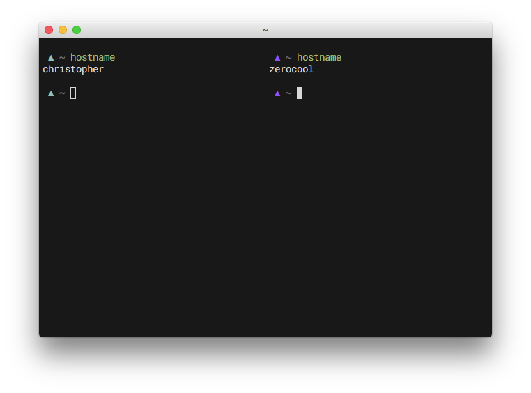

# geometry

geometry is a minimalistic, fully customizable zsh prompt theme.


geometry starts small, with reasonable defaults, and allows you to customize it at your own will.
It can be as simple or complex as you like.

If you have a question, suggestion, or request please [open an issue][] and be sure to check out [our contribution guide][]

- [geometry](#geometry)
  - [Installing](#installing)
  - [What it does](#what-it-does)
  - [Functions](#functions)
  - [Configuration](#configuration)
    - [general](#general)
    - [geometry_status](#geometrystatus)
    - [geometry_git](#geometrygit)
  - [Thanks](#thanks)

## Installing

*K, I'm sold. Beam me up, Scotty.*

tool          | add to `.zshrc`
--------------|--------------------------------------
[zr][]        | `zr load geometry-zsh/geometry`
[zplug][]     | `zplug "geometry-zsh/geometry"`
[antigen][]   | `antigen theme geometry-zsh/geometry`
**manually**  | `source geometry/geometry.zsh` (after `git clone https://github.com/geometry-zsh/geometry`)
[oh-my-zsh][] | `ZSH_THEME="geometry/geometry"` (after `git clone https://github.com/geometry-zsh/geometry $ZSH_CUSTOM/themes/`)

## What it does

All geometry does is run simple functions to customize the left and right prompts.

We bundle a few useful functions to start with, that can:

- give you a custom colored prompt symbol
- change the prompt symbol color according to the last command exit status
- make the prompt symbol color change with your hostname
- display current git branch, state and time since latest commit
- tell you whether you need to pull, push or if you're mid-rebase
- display the number of conflicting files and the total number of conflicts
- display if there is a stash
- display the running time of long-running commands
- set the terminal title to current command and directory
- make you the coolest hacker in the whole Starbucks

The right side prompt prints asynchronously, so you know it's going to be fast™.

Geometry also has a secondary prompt that shows up when pressing enter with an empty command, which you can configure with `GEOMETRY_INFO`.

## Functions

Geometry has very little architecture. Three environment variables define what is shown on the left, right, and on enter - `GEOMETRY_PROMPT`, `GEOMETRY_RPROMPT`, and `GEOMETRY_INFO`.

Most of these functions only show up if it makes sense to (for example, `geometry_git` only shows up if in a git repository).

To customize the prompt, just add any function to any of the `GEOMETRY_PROMPT`, `GEOMETRY_RPROMPT`, or `GEOMETRY_INFO` variables:

```sh
GEOMETRY_PROMPT=(geometry_status geometry_path) # redefine left prompt
GEOMETRY_RPROMPT+=(geometry_exec_time pwd)      # append exec_time to defaults
```

Please check out and share third-party functions on our [Functions wiki page](https://github.com/geometry-zsh/geometry/wiki/Functions).

For more details on how to create a function, check out [our contribution guide][]

## Configuration

You can configure everything in geometry by defining a variable.

The default configuration tries to balance the theme to be both lightweight and contain useful features.

Here we highlight some of the more commonly customized variables, but to see all of them, look in the function definitions inside the [functions directory](/function).

### general

```shell
GEOMETRY_SEPARATOR=" "    # use ' ' to separate function output
```

### geometry_status

```shell
GEOMETRY_STATUS_SYMBOL="▲"             # default prompt symbol
GEOMETRY_STATUS_SYMBOL_ERROR="△"       # displayed when exit value is != 0
GEOMETRY_STATUS_COLOR_ERROR="magenta"  # prompt symbol color when exit value is != 0
GEOMETRY_STATUS_COLOR="white"          # prompt symbol color
GEOMETRY_STATUS_COLOR_ROOT="red"       # root prompt symbol color
GEOMETRY_STATUS_COLOR_HASH=true        # color status symbol based on hostname
```



### geometry_git

The git function is one of the most developed plugins in geometry.
**We recommend installing `rg` or `ag` for the best performance with `geometry_git`**.
If you want to customize what is shown, instead of using `geometry_git`, feel free to use the helper functions `geometry_git_{symbol, branch, conflicts, time, stashes & status}`. You may also want to use `geometry::git_wrapper` to have the nice `::` joining.

```shell
GEOMETRY_GIT_SYMBOL_REBASE="\uE0A0" # set the default rebase symbol to the powerline symbol 
GEOMETRY_GIT_SYMBOL_STASHES=x       # change the git stash indicator to `x`
GEOMETRY_GIT_COLOR_STASHES=blue     # change the git stash color to blue
GEOMETRY_GIT_GREP=ack               # define which grep-like tool to use (By default it looks for rg, ag and finally grep)
GEOMETRY_GIT_NO_COMMITS_MESSAGE=""  # hide the 'no commits' message in new repositories
GEOMETRY_GIT_TIME_DETAILED=true     # show full time (e.g. `12h 30m 53s`) instead of the coarsest interval (e.g. `12h`)
```


## Thanks

geometry is maintained by [fribmendes](https://github.com/fribmendes), [desyncr](https://github.com/desyncr) and [jedahan](https://github.com/jedahan).

A big thank you to the dozens of [additional contributors](https://github.com/geometry-zsh/geometry/graphs/contributors).

[open an issue]: https://github.com/geometry-zsh/geometry/issues/new
[zr]: https://github.com/jedahan/zr
[zplug]: https://github.com/zplug/zplug
[antigen]: https://github.com/zsh-users/antigen
[oh-my-zsh]: https://github.com/robbyrussell/oh-my-zsh
[our contribution guide]: contributing.md
